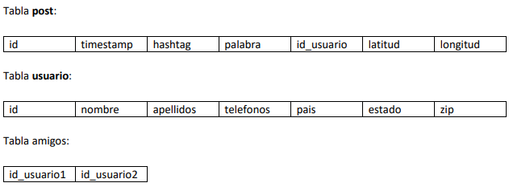
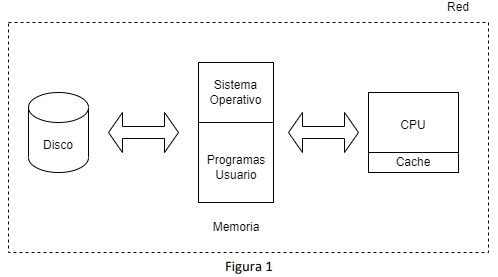

# Examen final 
# 2019185076 - Max Richard Lee Chung

## Pregunta 1 (60 pts)
Time No More es la red social más pequeña jamás creada, es conocida como One Word Social Network (OWSN), este término fue acuñado por un profesor mientras diseñaba un examen, el funcionamiento es muy simple, como en cualquier otra red social las personas pueden tener amigos y postear mensajes, pero en este caso son simples mensaje con una palabra.
En sus primeros 2 meses, Time No More logró reunir cerca de 500 mil usuarios, con un volumen de queries de escrituras (nuevos posts) de 5 posts por segundo y un volumen de queries de lectura de 100 queries por segundo.
Originalmente esta OSWSN fue creada en una base de datos relacional, se puede asumir que es un motor MariaDB standalone en se encuentra la casa de uno de los fundadores, esto está causando muchos problemas de rendimiento y se estima que en menos de 4 meses si el crecimiento se mantiene como en los dos primeros meses la base de datos colapsará.
Esta red social, aunque simple se ha hecho popular, ya que permite entre otras cosas, mostrar el estado de ánimo, exponer deseos, aspiraciones, y otros, todo en una sola palabra, lo cual es sumamente conveniente para hacer análisis de mercadeo y además simplifica los modelos de inteligencia artificial.
También entre la juventud se hizo muy popular enviar mensajes palabra por palabra o hasta construir historias, donde cada persona escribe una palabra con un hashtag (máximo 1) y mediante el tiempo de inserción en la base de datos, se va construyendo una historia, esto ha sido utilizado por grupos con malas intenciones para enviar mensajes inapropiados o coordinar grupos de odio, que normalmente evitan enviar el hashtag para evitar ser descubiertos, al ser una base de datos relacional y al ser una característica muy utilizada, la base de datos relacional no está funcionando correctamente ya que los queries duran mucho tiempo.
Cada registro de la base de datos Time No More, tiene el siguiente formato:

En calidad de CTO de la compañía Timeouts No More, ustedes han sido contactados o contactadas para ayudar a Time No More e intentar solucionar el problema, por esta razón debe realizar las siguientes tareas:

* Dar una solución detallada de cómo podría mejorar el rendimiento de la base de datos actual, reduciendo el downtime al mínimo, esto permitirá ganar tiempo para dar una solución mucho más duradera con la mínima afectación a los usuarios. (10 pts)

La primera opción para evitar problemas de afectación de usuario es implementar más hardware para añadir más réplicas para el manejo de datos sin que el sistema se caiga por sobrecargas de trabajo. De esta manera, se pueden incluir o analizar el tipo de hardware que se quiere complementar por los tipos de información, por ejemplo las fotos se pueden almacenar en un sistema frío o congelado ya que no se visitarán mucho. Si se mantiene como una base de datos relacional, se podría configurar el nivel de consistencia de los datos para que se actualice y muestre al usuario las noticias de forma rápida pero con la opción de perder datos si se realizan cambios simultáneos. Se podrían combinar las tablas para que sólo se tenga que hacer una única lectura o escritura de la tabla con los datos más relevantes, sin embargo, con los datos ya ingresados, se podría crear algún conflicto y tiempo para poder almacenarlos junto con el tiempo de diseño del sistema. Como la aplicación se está volviendo cada vez más popular y si se encuentran fallos de conectividad en ciertas regiones, se podría implementar un nuevo datacenter pequeño para mejorar los tiempos de respuesta. 

* Dar una recomendación detallada de qué tipo de base de datos se debería utilizar para abordar este problema, además debe recomendar algunas de las bases de datos SQL o NoSQL estudiadas durante el curso tanto en lecturas, así como las utilizadas en proyectos o ejemplos en clase. Tome en cuenta que sería posible utilizar más de una base de datos para optimizar el almacenamiento de los datos de la tabla post, amigos y usuario, tome en cuenta que tan fácil es escalar la base de datos en su recomendación, debe dar prioridad a servicios managed services y SaaS, no olvide la localidad y naturaleza de los datos. (30 pts)

La base de datos de recomendación es MongoDB, cuya estructura es no relacional o no sql. Utiliza formatos JSON (Javascript Object Notation) para guardar los datos en documentos, aunque no sea muy eficiente (ya que guardan todos los datos en texto) es muy versátil para poder exportar la información a otras bases de datos. La consistencia puede ser personalizada dependiendo de lo que se requiera. Las tablas de Mongo son colecciones para guardar cualquier tipo de dato y se pueden añadir campos (columnas) cuando se requiera con cualquier tipo de dato y funcionan con esquemas (schemas) el cual es un diccionario de datos. MongoDB utiliza “data drivers” que son parecidos a bibliotecas de los lenguajes para poder tener un buen rendimiento y su uso de índices son limitados, basados en la separación de los shards (fragmento de la base de datos que define el tamaño máximo del índice) y shards keys (llave principal que permite una distribución equitativa de datos en un shard). Además, utiliza un sistema de load balancer para manejar las caídas y control de datos almacenados en los bloques (identificados con los shards keys), en donde utiliza recursos por estar reutilizando los datos y consumiendo ancho de banda para mover datos entre los shards y mantenerlos de forma equitativa (hashed sharding).

Tiene una característica llamada Mongo Zones para poder implementar localidad (ranged sharding) de las réplicas de servidores y shards, en donde la información se divide por cada zona disponible en una zona geográfica. Las zonas están diseñadas para poder controlar la privacidad de datos por zona o región y que el usuario pueda acceder de forma rápida a los datos solicitados (zoned sharding). Por último, Mongo también define sus tipos de almacenamientos por tipo de dato almacenado como caliente, tibio, frío y congelado. 

* Comente acerca de qué tan conveniente es mantener la base de datos actual en la casa de uno de los fundadores, comparado con mover ésta algún Cloud Provider como AWS. (10 pts)

Sería preferible mover la base de datos a algún Cloud Provider, ya que se podría dejar en un punto medio de toda la región y mejorar el tiempo de respuesta de los datos al usuario dado que se debe de recorrer una menor cantidad de ancho de banda. De esta forma, si la base de datos se mantiene en la oficina, para algunos usuarios, la conectividad es casi nula si la oficina se encuentra en un extremo y el usuario del otro extremo de la región. Además, si se crea una falla de luz por algún desastre natural o problemas sistemáticos, la base de datos se encontrará inactiva durante su tiempo de mantenimiento hasta que se arregle la base principal, dejando la aplicación completamente inservible. No obstante, los Clouds Providers proveen la opción de mantener los datos seguros el mayor tiempo posible por tener diferentes localidades de almacenamiento con un sistema de consenso entre réplicas para definir una réplica principal de forma temporal y si se cae, se traslada el liderazgo a otra réplica mientras se arregla el anterior o incluso crear una nueva (si es posible) para poder mantener la harmonía entre las réplicas.

* Basándose en el funcionamiento de un índice invertido el cual fue estudiado en clase y es utilizado por motores como Elasticsearch y el concepto de Natural Language Processing (NLP) llamado Stemming el cual también fue discutido en clase, comente ¿Cómo se podría reducir el memory footprint de la base de datos actual? (10 pts)

Utilizando índices invertidos, se podría reducir el memory footprint por medio de la selección de palabras clave, como por ejemplo los hashtags, para poder disminuir los datos de la página a guardar mediante una asignación con la información más conocida o popular por medio de la selección de palabras relevantes o de mayor uso del sistema. Además, permite facilitar a la página recomendar o buscar archivos relacionados a la palabra dado que están ordenados de forma alfabética con su respectiva lista de archivos de dónde proviene y su clasificación o popularidad. Como los motores reciben retroalimentación de las búsquedas, se podrían mejorar la precisión de los términos en tendencia. Con respecto al Stemming, se podrían utilizar las palabras almacenadas o filtradas y clasificadas por el índice para poder seleccionar la raíz de las palabras con el fin de generar árboles menos profundos, el cual optimiza el espacio consumido ya que podrían llegar a ser muy repetitivas y que consuman mucho espacio, como por ejemplo, almacenar la palabra “comer” y eliminar “comiendo”, “comí”, “comiste”, “comeré”, entre otros.

## Pregunta 2 (10 pts)
Comente, ¿Cómo afectan los índices en el rendimiento de las bases de datos relacionales?, enfoque su respuesta tanto en cómo benefician el rendimiento así como la forma en la cual lo impactan de forma negativa.
Suponiendo que el hardware no es un problema (se puede comprar cuanto se necesite), ¿Podemos crear cuantos índices queramos o estos no tendrán mayor impacto en el rendimiento? 

Los índices afectan el rendimiento de las bases de datos relacionales dependiendo principalmente sobre los tipos de consultas que se van a realizar. Los índices clúster tienen un único índice, por lo que puede facilitar el rendimiento de una única consulta, el cual la hace instantánea, sin embargo, si se tiene que realizar búsquedas en otras tablas, puede empeorar el rendimiento por tener que buscar y analizar en tablas exteriores. Los índices no clúster tienen un mejor beneficio al tener que buscar entre múltiples tablas, ya que pueden almacenar varios índices para incluir diferentes palabras clave en la búsqueda, sin embargo, consume espacio de memoria para poder almacenar tantos índices. Los índices hash tienen el mejor rendimiento en cuanto organización de datos ya que tienen una estructura similar a un árbol B + para acomodar los datos y facilitar las búsquedas como se requiera, así como su organización y se pueden ingresar todos los índices necesarios para crear otros árboles, sin embargo, la estructura consume mucho espacio y si se consultan varios índices al mismo tiempo, puede ser lento. Los índices de expresión tienen una mejora en rendimiento de escrituras cuando existan funciones que se deban de ejecutar ya que la información se encuentra pre-cargadas en memoria para poder reducir el tiempo de ejecución, sin embargo, es necesario tener una buena memoria para almacenar los índices pero no se encuentran problemas a la hora de realizar lecturas. Los índices parciales tienen la ventaja de poder seleccionar qué se quiere guardar para excluir los demás datos irrelevantes y entre más pequeño sea, más datos se pueden ingresar a la memoria. Sin embargo, se deben de conocer las consultas y los casos de usos para poder optimizar la estrategia o método de trabajo, dado que se ocupan almacenar las más relevantes. Por último, existen los índices invertidos que particionan cada palabra de un texto para realizar un conteo y conseguir una clasificación según lo que se requiera, sin embargo, se deben de realizar muchas configuraciones para las estructuras básicas y problemas significativos entre idiomas. 

Se pueden crear tantos índices como se requieran, sin embargo, se debe de optimizar en la mejor medida posible durante la planificación para no saturar la memoria o memory footprint con las diferentes consultas realizadas. De este modo, se puede mantener un buen rendimiento, estabilidad y tiempo de respuesta dependiendo del caso. Por ejemplo, si sólo se realizan consultas de la fecha de nacimiento de una persona, el índice clúster tiene la mejor clasificación para poder realizar dicha tarea dado que únicamente se solicita un dato del índice. Sin embargo, si se requieren consultar datos del automóvil de una persona, es mejor tener índices no clúster, para tener pre-cargada la tabla de automóviles. 

## Pregunta 3 (20 pts)
El rendimiento de todo sistema de base de datos puede verse afectado por muchos factores, uno de ellos es el ambiente en el cual se ejecuta, este se encuentra compuesto por los componentes de hardware y el sistema operativo y otros programas de usuario compitiendo por los recursos del computador. Comente de forma clara y concisa, ¿Cómo afecta el rendimiento de una base de datos los componentes ilustrados en la Figura 1? 

La temperatura del ambiente va a afectar directamente la temperatura de los cables, si el hardware se encuentra en un lugar caliente y con un sistema de enfriamiento deficiente, los componentes no se van a comportar como se supone deberían hacerlo. Componentes sensibles a esto son los buses de información, donde afectaría principalmente a la memoria caché y CPU. Ya dentro del funcionamiento interno de cada componente, los discos duros afectan principalmente por la calidad de diseño, como por ejemplo, la comparación de un disco SSD (Disco de estado sólido) y HDD (Hard Disc Drive) por su tasa de IOps (entradas y salidas de información/operación), por lo que un disco SSD, tiene mejor rendimiento actualmente. Además, la cantidad de memoria disponible, afecta exponencialmente la cantidad de datos que se pueden almacenar en físico, incluyendo la tasa de crecimiento en las búsquedas de archivos del sistema operativo. El tamaño de la caché afecta principalmente a los datos que se pueden almacenar temporalmente dentro de ellas para poder traer con mayor velocidad la información requerida, así como ir a buscar nueva información. La memoria tiene un alto costo significativo dentro del rendimiento en bases de datos, ya que por el tamaño que tengan, pueden almacenar muchas peticiones para poder mostrar los datos de forma inmediata a los usuarios. De este modo, la memoria, al ser compartida por los programas, entre mayor sea la cantidad de aplicaciones ejecutándose, menor rendimiento tendrá la memoria. Por último, la CPU afecta el rendimiento por la cantidad de núcleos que este posee, de este modo, permite que se puedan tener operaciones paralelas (threads o hilos) para procesar la información de la cola de espera. 

## Pregunta 4 (10 pts)
La escalabilidad automática es una característica muy deseada en los sistemas de bases de datos tanto SQL como NoSQL, la misma permite mediante la obtención de métricas en tiempo real interpretar el comportamiento actual para predecir el comportamiento futuro, con esto se puede ajustar tanto el hardware como la configuración de las bases de datos, para poder atender el workload de un sistema. Comente la importancia de la Observabilidad tanto a nivel de aplicación como de base de datos para lograr una escalabilidad automática adecuada, ¿Considera que las métricas de memoria, CPU y disco son suficientes para lograr ésta?

La observabilidad tiene una gran importancia ya que permite a los desarrolladores analizar sobre el comportamiento y flujo de datos de la propia aplicación y base de datos, con el fin de realizar configuraciones dentro de la automatización. De este modo, se pueden tomar decisiones de reducir o aumentar capacidades de almacenamiento de datos tanto almacenamiento de tipo de dato caliente, tibio, frío o congelado, al igual que añadir o eliminar réplicas, jobs o pods para tener un mejor tratamiento de datos paralelos. Como por ejemplo, si la carga de trabajo es muy alta, se puede configurar la base de datos para aumentar la cantidad de réplicas para disminuir la tasa. De esta forma, se puede detectar recursos necesarios o para aflojar el trámite o reutilizar y disminuir los recursos no usados. 

Con respecto a si se deben de ingresar nuevas métricas para definir el comportamiento, no creo que sean necesarios más métricas de las que ya se encuentran dado que con la información de la memoria, CPU y disco son suficientes dado que son las principales componentes que se deben de tomar en cuenta para considerar si el hardware soporta el movimiento y consumo de datos. 
