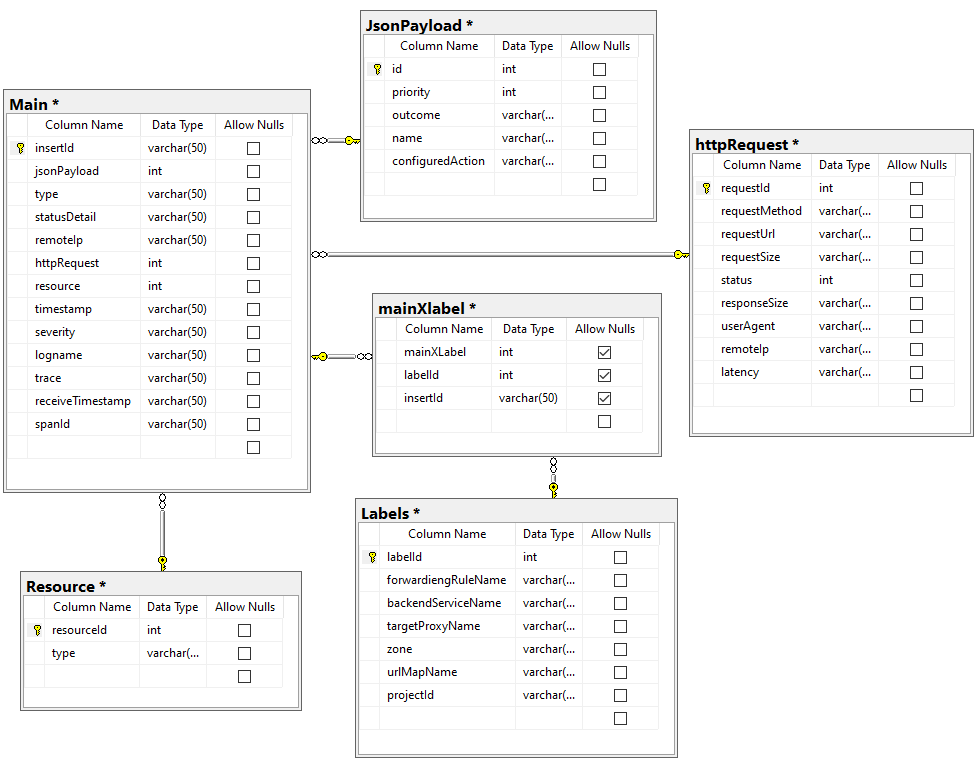

# Prueba corta #7 - 8
## Max Richard Lee Chung - 2019185076

1. Realice un modelo entidad relación normalizado hasta mínimo BCNF (Forma Normal de Boyce-Codd) de la siguiente información de logs almacenada por un balanceador de carga en la plataforma GCP:

```
{
    "insertId": "TTYTYII0899",
    "jsonPayload": {
    "enforcedSecurityPolicy": {
        "priority": 2147483647,
        "outcome": "DENY",
        "name": "allow-hosts",
        "configuredAction": "DENY"
    },
    "type":"type.googleapis.com/google.cloud.loadbalancing.type.LoadBalancerLogEntry",
    "statusDetails": "denied_by_security_policy",
    "remoteIp": "20.20.20.20"
    },
    "httpRequest": {
        "requestMethod": "GET",
        "requestUrl": "https://25.39.66.78/",
        "requestSize": "9898",
        "status": 403,
        "responseSize": "3258",
        "userAgent": "Mozilla/5.0 (Windows NT 6.2; WOW64) AppleWebKit/537.4(KHTML, like Gecko) Chrome/98 Safari/537.4",
        "remoteIp": "89.36.71.4",
        "latency": "0.150931s"
    },
    "resource": {
        "type": "http_load_balancer",
    "labels": {
        "forwarding_rule_name": "k8s2-hjasdjhasjd",
        "backend_service_name": "k8s-oioaidasoii",
        "target_proxy_name": "k8s2-ts-dasiudiasui",
        "zone": "global",
        "url_map_name": "k8s2-dashdjah",
        "project_id": "myGCPProject"
        }
    },
    "timestamp": "2022-09-01T18:53:12.784317Z",
    "severity": "WARNING",
    "logName": "projects/myGCPProject/logs/requests",
    "trace": "projects/myGCPProject/traces/hdajshdjas98989adsdjaks",
    "receiveTimestamp": "2022-09-01T18:53:13.333898212Z",
    "spanId": "hhhd888978da88"
}
```

